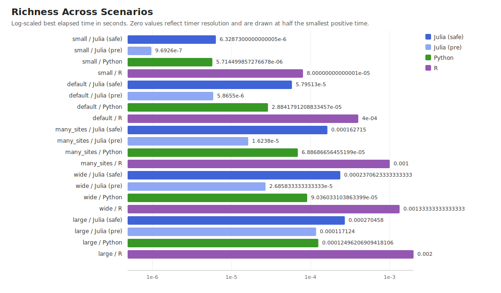
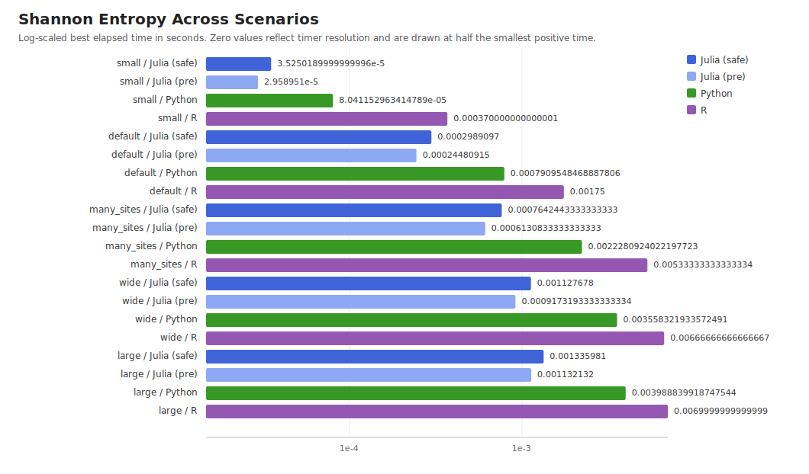
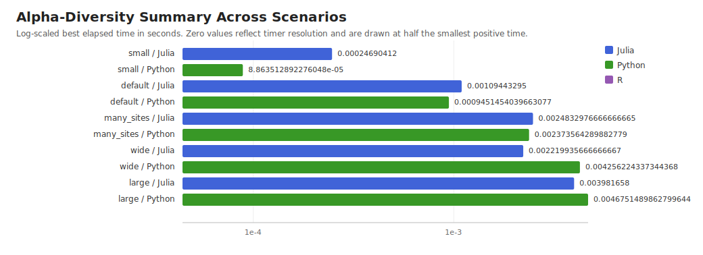
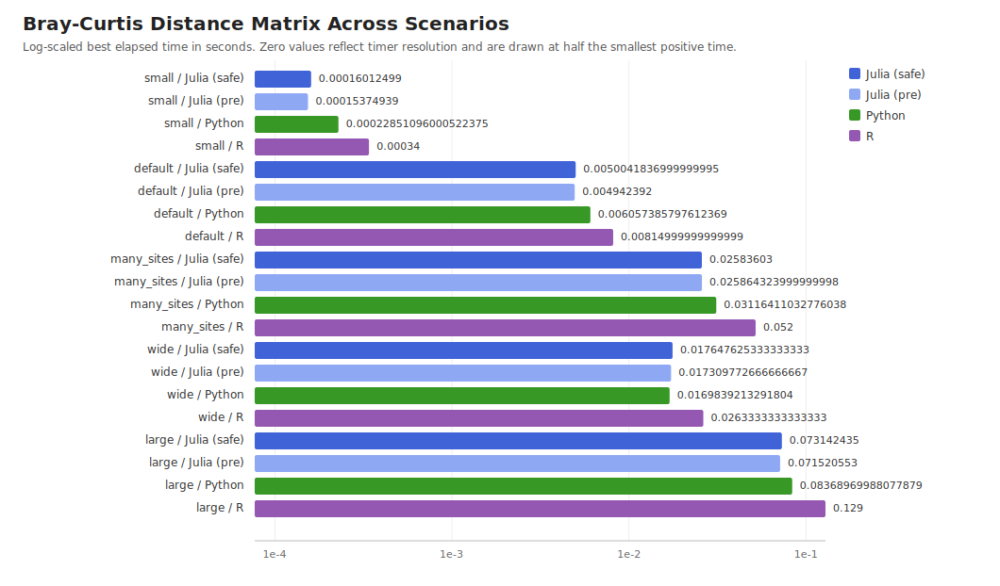
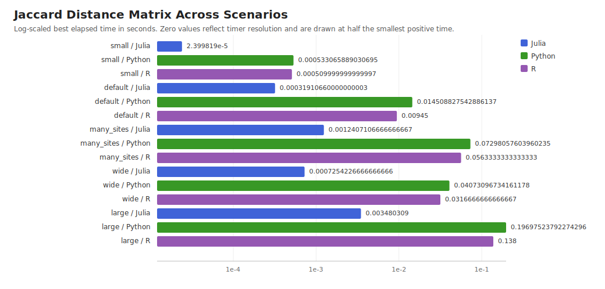
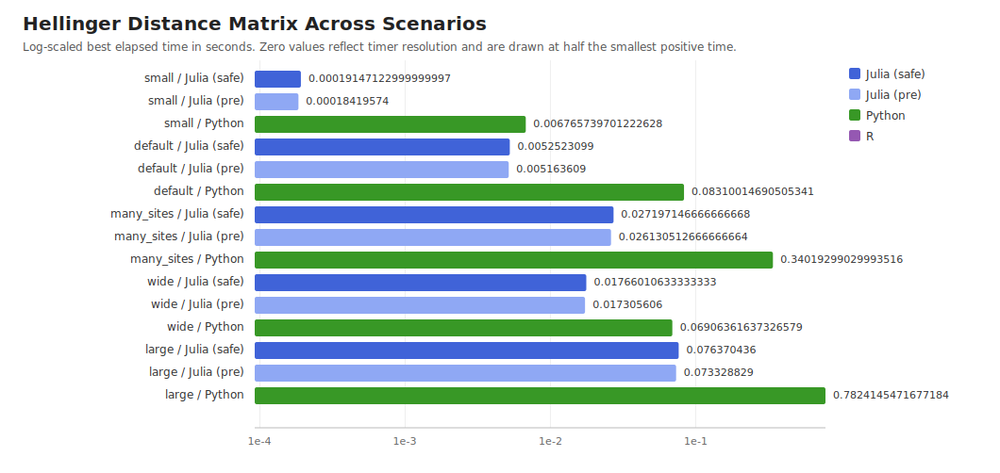

# DiversityAndDissimilarity Benchmark Report

Generated: 2026-06-10 16:58:27

Python interpreter: `/home/matt/.venvs/diversity-bench/bin/python`

## Environment

| Item | Value |
|---|---|
| CPU | `arrowlake-s` |
| CPU model | `Intel(R) Core(TM) Ultra 9 285K` |
| Machine | `x86_64-linux-gnu` |
| Operating system | `Linux` |
| Julia | `1.12.6` |
| Julia threads | `1` |
| Python interpreter | `/home/matt/.venvs/diversity-bench/bin/python` |

The benchmark matrix is generated deterministically at runtime for each scenario. Timings are best per-call elapsed time over the listed repeats and inner repetitions.

## Scenarios

| Scenario | Sites | Taxa | Total abundance | Repeats | Inner repetitions |
|---|---:|---:|---:|---:|---:|
| small | 120 | 80 | 5000 | 5 | 100 |
| default | 400 | 200 | 10000 | 5 | 20 |
| many_sites | 800 | 250 | 10000 | 3 | 3 |
| wide | 300 | 1000 | 20000 | 3 | 3 |
| large | 1200 | 300 | 20000 | 2 | 1 |

## Figures

Each figure shows Julia (safe), Julia (pre-validated), Python, and R bars per scenario on a shared log-scaled time axis. "Julia (safe)" validates on every call; "Julia (pre)" validates once before the loop.

### Richness Across Scenarios

Row-wise observed richness.

### Shannon Entropy Across Scenarios

Row-wise Shannon entropy.

### Alpha-Diversity Summary Across Scenarios

Compact exploratory alpha-diversity summary. R/vegan is not included because the R benchmark uses separate vegan calls.

### Bray-Curtis Distance Matrix Across Scenarios

Dense pairwise Bray-Curtis dissimilarity matrix.

### Jaccard Distance Matrix Across Scenarios

Dense pairwise incidence Jaccard distance matrix.

### Hellinger Distance Matrix Across Scenarios

Dense pairwise Hellinger distance matrix. R/vegan is not included for this direct helper comparison.

## Results

"Julia (safe)" validates on every call (default user experience). "Julia (pre)" calls `validate` once before the loop, matching the Python and R calling convention and providing a fair computational comparison.

### Small (120 sites × 80 taxa)

| Task | Julia (safe) | Julia (pre) | Python (numpy/scipy) | R/vegan |
|---|---:|---:|---:|---:|
| richness | 6.33 µs | 0.969 µs | 5.71 µs | 80.0 µs |
| Shannon entropy | 35.3 µs | 29.6 µs | 80.4 µs | 370.0 µs |
| alpha diversity | 248.0 µs | 246.0 µs | 90.7 µs | — |
| Bray-Curtis matrix | 160.0 µs | 154.0 µs | 229.0 µs | 340.0 µs |
| Jaccard matrix | 22.4 µs | 15.4 µs | 534.0 µs | 510.0 µs |
| Hellinger matrix | 191.0 µs | 184.0 µs | 6.77 ms | — |

### Default (400 sites × 200 taxa)

| Task | Julia (safe) | Julia (pre) | Python (numpy/scipy) | R/vegan |
|---|---:|---:|---:|---:|
| richness | 58.0 µs | 5.87 µs | 28.8 µs | 400.0 µs |
| Shannon entropy | 299.0 µs | 245.0 µs | 791.0 µs | 1.75 ms |
| alpha diversity | 1.1 ms | 1.04 ms | 949.0 µs | — |
| Bray-Curtis matrix | 5.0 ms | 4.94 ms | 6.06 ms | 8.15 ms |
| Jaccard matrix | 333.0 µs | 256.0 µs | 14.5 ms | 9.4 ms |
| Hellinger matrix | 5.25 ms | 5.16 ms | 83.1 ms | — |

### Many Sites (800 sites × 250 taxa)

| Task | Julia (safe) | Julia (pre) | Python (numpy/scipy) | R/vegan |
|---|---:|---:|---:|---:|
| richness | 163.0 µs | 16.2 µs | 68.9 µs | 1.0 ms |
| Shannon entropy | 764.0 µs | 613.0 µs | 2.23 ms | 5.33 ms |
| alpha diversity | 2.53 ms | 2.34 ms | 2.2 ms | — |
| Bray-Curtis matrix | 25.8 ms | 25.9 ms | 31.2 ms | 52.0 ms |
| Jaccard matrix | 1.31 ms | 1.78 ms | 73.5 ms | 56.3 ms |
| Hellinger matrix | 27.2 ms | 26.1 ms | 340.0 ms | — |

### Wide (300 sites × 1000 taxa)

| Task | Julia (safe) | Julia (pre) | Python (numpy/scipy) | R/vegan |
|---|---:|---:|---:|---:|
| richness | 237.0 µs | 26.9 µs | 90.4 µs | 1.33 ms |
| Shannon entropy | 1.13 ms | 917.0 µs | 3.56 ms | 6.67 ms |
| alpha diversity | 2.22 ms | 2.0 ms | 4.26 ms | — |
| Bray-Curtis matrix | 17.6 ms | 17.3 ms | 17.0 ms | 26.3 ms |
| Jaccard matrix | 524.0 µs | 301.0 µs | 40.9 ms | 31.7 ms |
| Hellinger matrix | 17.7 ms | 17.3 ms | 69.1 ms | — |

### Large (1200 sites × 300 taxa)

| Task | Julia (safe) | Julia (pre) | Python (numpy/scipy) | R/vegan |
|---|---:|---:|---:|---:|
| richness | 270.0 µs | 117.0 µs | 125.0 µs | 2.0 ms |
| Shannon entropy | 1.34 ms | 1.13 ms | 3.99 ms | 7.0 ms |
| alpha diversity | 4.36 ms | 3.85 ms | 4.19 ms | — |
| Bray-Curtis matrix | 73.1 ms | 71.5 ms | 83.7 ms | 129.0 ms |
| Jaccard matrix | 3.39 ms | 2.87 ms | 198.0 ms | 138.0 ms |
| Hellinger matrix | 76.4 ms | 73.3 ms | 782.0 ms | — |

## Notes

- Dense pairwise distance matrices scale quadratically in the number of sites.
- Reported times are per call. Small scenarios use larger inner repetition counts to avoid coarse timer-resolution artifacts.
- The Julia benchmark runs every timed function once before measurement so JIT compilation work is not included in the reported timings.
- Julia and R timings call package-level APIs. Python uses NumPy/SciPy reference workflows in `benchmark/python_benchmark.py`.
- The benchmark is intended to compare practical workflows, not isolated kernel implementations.
