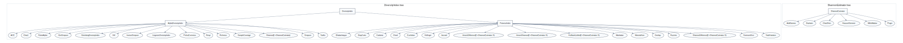

# Framework

The package framework has two jobs. First, it gives users a small set of
generic operations for diversity and pairwise comparison. Second, it exposes
the conventions behind those operations as machine-readable metadata.

This page describes the type structure, input and output contracts,
architecture, goals, non-goals, and metadata traits that future versions should
preserve.

## Type Structure

The public type hierarchy has two roots:

- [`DiversityIndex`](@ref): alpha-diversity and pairwise comparison indices.
- [`ShannonEstimator`](@ref): entropy and information-divergence estimators.

`DiversityIndex` splits into:

- [`AlphaDiversityIndex`](@ref), for one-assemblage summaries such as
  [`Richness`](@ref), [`Shannon`](@ref), [`Hill`](@ref), [`Chao1`](@ref), and
  [`PielouEvenness`](@ref).
- [`PairwiseIndex`](@ref), for two-assemblage comparisons such as
  [`Jaccard`](@ref), [`BrayCurtis`](@ref), [`Hellinger`](@ref),
  [`KullbackLeibler`](@ref), and [`JensenShannon`](@ref).

The tree is intentionally shallow. Most behavior lives in methods and metadata
traits rather than deep inheritance.



The type-tree assets are generated from exported package types:

```bash
julia --project=docs docs/make_type_trees.jl
```

The script writes DOT, SVG, and PDF files under `docs/src/assets`.

## Data Inputs

Input interpretation is deliberately consistent across the package. See
[Data Input Formats](data-input.md) for the full reference including orientation
rules, keyword parameters, and the pre-validated pipeline.

| Input | Interpretation |
|---|---|
| Dictionary | `category => abundance` map. |
| Numeric vector | Abundance vector by default. |
| Non-numeric vector | Raw observations. |
| Numeric vector with `frequencies=false` | Raw observations represented by numeric labels. |
| Matrix | Samples in rows, taxa/categories in columns. |
| Tables.jl-compatible table | Converted with [`community_matrix`](@ref); use `species` to choose taxa columns. |

```jldoctest frameworkpage
julia> using DiversityAndDissimilarity

julia> counts(["oak", "ash", "oak"]) == Dict("oak" => 2, "ash" => 1)
true

julia> richness([1, 2, 1, 3]; frequencies=false)
3

julia> community = [1 1 2 0 5; 3 0 1 1 0];

julia> richness(community)
2-element Vector{Int64}:
 4
 3
```

Invalid abundance data fails early with a message identifying the row and
column: negative values, non-finite values, and all-zero rows are not silently
repaired.

## Outputs

The main output contracts are:

- scalar values for one assemblage;
- vectors of row-wise values for community matrices;
- dense pairwise matrices for community-matrix pairwise comparisons;
- named tuples for labeled matrix helpers and audits;
- named tuples for metadata, bounds, estimator reports, and validation results.

```jldoctest frameworkpage
julia> metadata = index_metadata(BrayCurtis());

julia> metadata.output_mode
:dissimilarity

julia> metadata.bounds.lower_meaning
"minimal dissimilarity; identical or indistinguishable inputs"

julia> labeled_distance(BrayCurtis(), community; labels=["a", "b"]).labels
2-element Vector{String}:
 "a"
 "b"
```

## Architecture

The source layout follows the main conceptual layers:

- `src/DiversityAndDissimilarity.jl`: module, exports, and includes.
- `src/utilities.jl`: input handling, `counts`, `proportions`, and
  `community_matrix`.
- `src/diversity.jl`: alpha-diversity indices, entropy estimators, uncertainty,
  bootstrap/jackknife, and alpha summaries.
- `src/similarity.jl`: pairwise similarity, dissimilarity, distance, and
  divergence indices.
- `src/framework.jl`: metadata traits, reference cases, estimator reports, and
  audit helpers.
- `validation`: external reference datasets and cross-package manifests.
- `docs`: Documenter manual and generated assets.
- `notes`: LaTeX notes, references, and manuscript-style materials.

The generic operations are the center of the API:

```julia
entropy(index, data)
diversity(index, data)
effective_diversity(index, data)
similarity(index, left, right)
dissimilarity(index, left, right)
distance(index, left, right)
```

Convenience functions should call the same implementation path rather than
forming a parallel API.

## Detailed Goals

- Provide clear, tested implementations of common diversity and pairwise
  comparison indices.
- Make convention choices explicit, especially where names differ across
  fields or packages.
- Keep row-wise community matrix semantics stable.
- Support dictionaries, vectors, matrices, observation vectors, and
  Tables.jl-compatible data.
- Keep the runtime dependency footprint small.
- Reuse estimator objects across entropy and information-divergence workflows.
- Maintain cross-package validation against hand calculations, vegan,
  scikit-bio, SciPy, iNEXT, and published examples.
- Keep documentation executable or generated where that reduces drift.

## Detailed Non-Goals

- The package is not a full ecological modelling framework.
- It is not an ordination, regression, null-model, or rarefaction-curve
  package.
- It should not absorb every index from every ecosystem without clear
  convention, tests, and documentation.
- It should not hide convention differences behind a single string-based
  `method` interface.
- It should not add heavy runtime dependencies for optional documentation,
  plotting, validation, or manuscript workflows.
- It should not overstate mathematical properties. Use `:unknown` where the
  package has not encoded a confident claim.

## Metadata And Traits

[`index_metadata`](@ref) collects convention-aware metadata:

```jldoctest frameworkpage
julia> m = index_metadata(JensenShannon());

julia> m.family
:probability

julia> m.is_metric
true

julia> m.is_bounded
true
```

The lower-level helpers are plain functions so generic workflows can branch on
them without depending on internal implementation details:

```jldoctest frameworkpage
julia> index_family(BrayCurtis())
:abundance

julia> output_mode(Jaccard())
:similarity

julia> is_symmetric(KullbackLeibler())
false

julia> is_triangular(Overlap())
:unknown

julia> index_range(PielouEvenness())
(lower = 0.0, upper = 1.0)
```

[`index_bounds`](@ref) adds interpretation to numeric ranges. For a similarity,
the lower bound usually means no overlap. For a dissimilarity or distance, the
lower bound usually means identical or indistinguishable inputs.

```jldoctest frameworkpage
julia> index_bounds(Jaccard()).lower_meaning
"minimal similarity; conventionally complete dissimilarity or no overlap"

julia> index_bounds(KullbackLeibler()).upper_meaning
"unbounded dissimilarity; larger values mean greater separation"
```

## Metric-Like Traits

The metric helpers are conservative:

| Trait | Meaning in this package |
|---|---|
| [`is_metric`](@ref) | Nonnegative, zero iff identical, symmetric, triangular. |
| [`is_pseudometric`](@ref) | Metric-like but distinct inputs may have zero distance. |
| [`is_quasimetric`](@ref) | Metric-like but symmetry is not required. |
| [`is_metametric`](@ref) | Nonnegative, symmetric, zero for identical inputs; no triangle claim. |
| [`is_semimetric`](@ref) | Nonnegative, symmetric, zero iff identical; no triangle claim. |
| [`is_premetric`](@ref) | Nonnegative and zero for identical inputs. |
| [`is_supermetric`](@ref) | Reverse-triangle or supermetric-style condition; uncommon here. |

Unknown classifications return `:unknown`.

## Reports And Audits

The framework also provides small reporting helpers:

```jldoctest frameworkpage
julia> r = estimator_report([1, 1, 2, 0, 5]);

julia> r.observed_richness
4

julia> all(result -> result.passed, validate_reference_cases())
true

julia> audit = diversity_audit(community; labels=["a", "b"]);

julia> audit.n_samples
2
```

Use [`uncertainty_audit`](@ref) for row-wise bootstrap summaries during
workflow checks.

## Reference

```@docs
index_metadata
index_family
input_mode
output_mode
is_finite
is_metric
is_triangular
is_nonnegative
is_bounded
is_pseudometric
is_quasimetric
is_metametric
is_semimetric
is_premetric
is_supermetric
is_similarity
is_dissimilarity
is_dissimiliarty
is_symmetric
index_range
index_bounds
requires_probabilities
supports_matrix_kernel
reference_cases
validate_reference_cases
estimator_report
diversity_audit
uncertainty_audit
```
